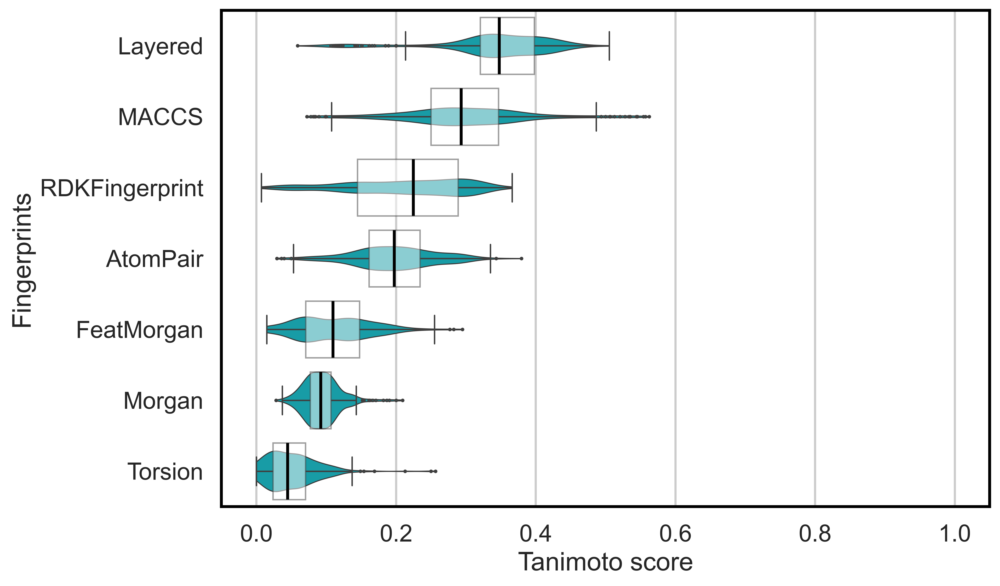
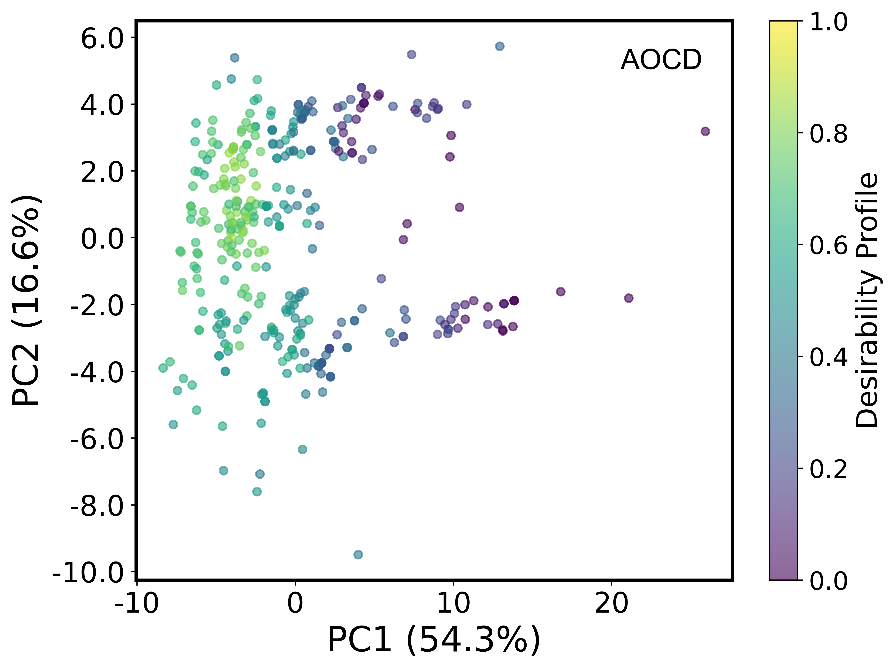

# HDDFlyzer

<section class="hdf-hero">
  <div class="hdf-hero__content">
    <p class="hdf-eyebrow">Cheminformatics descriptor-space analysis</p>
    <div class="hdf-brand" aria-label="HDDFlyzer">
      <span class="hdf-dotmark" aria-hidden="true">
        <span></span><span></span><span></span>
        <span></span><span></span><span></span>
        <span></span><span></span><span></span>
      </span>
      <span class="hdf-wordmark">HDDFlyzer</span>
    </div>
    <p class="hdf-subtitle">Traceable, reproducible molecular descriptor-space workflows for CLI and Python.</p>

    <div class="hdf-actions">
      <a class="md-button md-button--primary" href="usage/#installation">Install</a>
      <a class="md-button" href="usage/#quick-start">Quick start</a>
      <a class="md-button" href="api/">API Reference</a>
      <a class="md-button" href="changelog/">Changelog</a>
    </div>

    <div class="hdf-badges">
      <a href="https://github.com/NanoBiostructuresRG/hddflyzer/actions/workflows/ci.yml"></a>
      <a href="https://pypi.org/project/hddflyzer/"></a>
      <a href="https://pypi.org/project/hddflyzer/"></a>
      <a href="https://github.com/NanoBiostructuresRG/hddflyzer/blob/main/LICENSE"></a>
    </div>
  </div>
</section>

!!! note "Pre-stable"
    HDDFlyzer is currently in Alpha-stage development. The public API is being
    hardened before stability is declared.

<section class="hdf-panel">
  <div class="hdf-grid hdf-grid--three">
    <article class="hdf-card">
      <span class="hdf-card__icon">REG</span>
      <h3>Registry</h3>
      <p>Build a canonical molecule registry from local SDF, CSV, or SMILES collections.</p>
    </article>

    <article class="hdf-card">
      <span class="hdf-card__icon">DSC</span>
      <h3>Descriptors &amp; similarity</h3>
      <p>Compute molecular descriptors and Tanimoto similarity matrices with full provenance.</p>
    </article>

    <article class="hdf-card">
      <span class="hdf-card__icon">VIZ</span>
      <h3>Projection &amp; visualization</h3>
      <p>Reduce dimensionality with PCA, t-SNE, and UMAP, then generate publication-ready figures.</p>
    </article>
  </div>
</section>

## Why HDDFlyzer?

Exploratory cheminformatics often starts with a practical question: how are the molecules in a collection distributed across a descriptor space? In practice, answering that question usually requires several connected steps. The input molecules are prepared, descriptors or fingerprints are calculated, similarity relationships are computed, dimensionality-reduction methods are applied, and figures are generated for inspection.

When these steps are handled with separate scripts, notebooks, or output folders, the analysis can become difficult to revisit. A figure may exist without an obvious link to the molecule table behind it. A projection file may be separated from the descriptors or similarity matrix used to create it. After several runs, it may be unclear which outputs belong together, which parameters were used, or whether two visualizations were generated from comparable molecular representations.

**HDDFlyzer** (High-Dimensional Descriptor-based Feature Space Analyzer) addresses this fragmentation by treating the prepared molecular dataset as the anchor of the analysis. It provides a local, CLI-first workflow with a Python API for organizing descriptor-space exploration as a connected computational record. Each run links the molecule registry, descriptor tables, Tanimoto similarity outputs, PCA, t-SNE, and UMAP coordinates, figures, manifests, and execution metadata within a structured result folder.

This connected record allows completed analyses to be revisited, inspected, compared, and extended while preserving the relationship between molecules, computed representations, and downstream artifacts.

## Molecular Features Represented

HDDFlyzer builds descriptor tables from molecular features calculated for each compound. These features describe complementary aspects of molecular structure and provide the numerical basis for similarity analysis, dimensionality reduction, and visualization.

| Descriptor group | Representative features used by HDDFlyzer |
|---|---|
| Size and composition | `MW`, `HeavyAtomCount`, `HeavyAtomMolWt`, `NumHeteroatoms`, `NumValenceElectrons` |
| Polarity and molecular surface | `TPSA`, `LabuteASA`, `MolMR`, `PolarSurfaceArea_Fraction`, `PolarAtom_Fraction` |
| Hydrogen bonding | `NumHDonors`, `NumHAcceptors`, `NHOHCount`, `NOCount`, `HDonor_Acceptor_Ratio` |
| Lipophilicity and refractivity | `MolLogP`, `MolLogP_MW_Ratio`, `SlogP_VSA1`, `SlogP_VSA2` |
| Rings, flexibility, and topology | `RingCount`, `NumRotatableBonds`, `FractionCSP3`, `BalabanJ`, `BertzCT`, `Kappa1`, `NumAromaticRings` |
| Electronic and VSA descriptors | `MaxPartialCharge`, `MinPartialCharge`, `PEOE_VSA1`, `SMR_VSA1` |
| Shape-related descriptors | `PMI1`, `PMI2`, `PMI3`, `NPR1`, `NPR2` |
| Composite molecular scores | `QED`, `LeadLikeness_Score`, `Pharma_Complexity`, `Synthetic_Accessibility`, `Desirability_Profile` |

Fingerprint/Tanimoto outputs such as `morgan_tanimoto`, `atompair_tanimoto`, and `maccs_tanimoto` are structural similarity relationships. PCA, t-SNE, and UMAP coordinates are derived projections created from descriptor or similarity spaces, not original molecular features.

### Descriptor-Space Provenance

In HDDFlyzer, a plot is treated as the visible outcome of a computational path. That path includes the molecular collection, the descriptor or similarity representation, the dimensionality-reduction method, and the parameters used during execution.

By keeping these elements together, HDDFlyzer makes it easier to return to a previous analysis, inspect the generated artifacts, and compare molecular representations using consistent molecule identities. The focus is practical provenance: knowing how a result was produced and how to find the files that support it.

<section class="hdf-figure-pair">
  <figure>
    
    <figcaption>Fingerprint-derived molecular relationships.</figcaption>
  </figure>

  <figure>
    
    <figcaption>Descriptor-space projection from a reconstructed run.</figcaption>
  </figure>
</section>

## What You Provide and Receive

| You provide | HDDFlyzer returns |
|---|---|
| A local molecular collection (SDF, CSV, or SMILES file). | A structured `results/<tag>/` folder with all outputs. |
| A dataset tag and workflow parameters. | Descriptor tables, similarity matrices, and projection coordinates. |
| Optional group definitions for comparison. | Figures, metadata, a manifest, and a workflow summary. |

## Citation

```text
Contreras-Torres, F. F. and Saldivar-González, F. I. (2026). HDDFlyzer: High-Dimensional Descriptor-based Feature Space Analyzer. https://github.com/NanoBiostructuresRG/hddflyzer
```

## License

This project is licensed under the terms of the
[GNU Lesser General Public License v3.0 or later](https://github.com/NanoBiostructuresRG/hddflyzer/blob/main/LICENSE).
SPDX identifier: `LGPL-3.0-or-later`.
